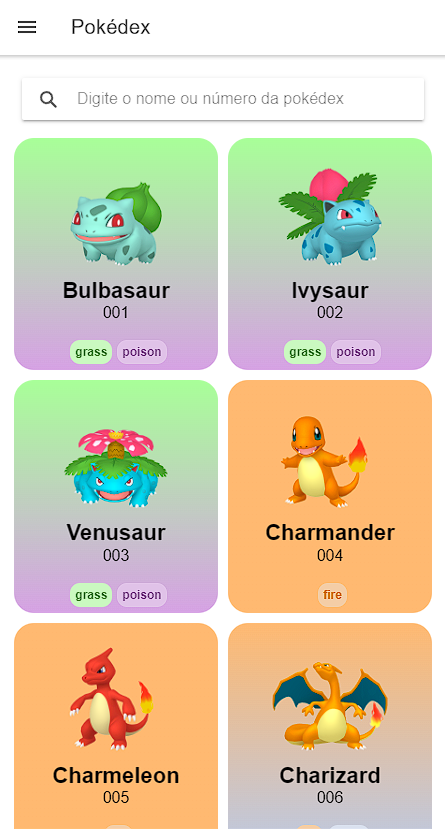

# Pokédex Híbrida

[](https://ionicframework.com/) [](https://pt-br.reactjs.org/) [](https://capacitorjs.com/)

Uma simples pokédex da região de Kanto, reveja seus pokémons favoritos com sprites detalhadas e renovadas. Aplicativo criado com Ionic e React.

## 🎬 <a href="https://pokedex.foxtag.com.br" target="_blank">Ver a Desmonstração</a>

 <p align="center">
  <a src="https://pokedex.foxtag.com.br" target="_blank"></a>
</p>

## ❓ Intuito do projeto

Eu montei esse projeto apenas para estudar e manter ativo no portfólio, espero que assim como os muitos projetos que ja encontrei aqui me ajudaram, esse projeto possa ajudar você também :)

## ⚠️ Aviso

O Projeto ainda não está concluído, está em fase de desenvolvimento por se tratar de um projeto para estudo.

## ⚙️ Funcionalidades

- [x] Tela Inicial

  - [x] Listagem dos pokémons
  - [x] Filtro por nome e código nacional
  - [ ] Filtro por tipo
  - [ ] Detalhes do pokémon selecionado

- [x] Tela de configuração
  - [ ] Alterar o tipo da sprite que ficará visivel
  - [ ] Personalizar nome do treinador

---

## 🚀 Vamos começar?

Caso deseje testar esse projeto, siga os passos abaixo!

```bash

# Primeiro clone este repositório
  $  git clone https://github.com/linhous/pokedex.git

# Entre na pasta pokedex
  $  cd pokedex

# Execute o npm para instalar as dependências
  $  npm install

# Agora iniciei o server para testar em modo web
  $  ionic serve

# Siga os passos da documentação do site do ionic framework
# para adicionar outros capacitores como Android ou IOS
```
